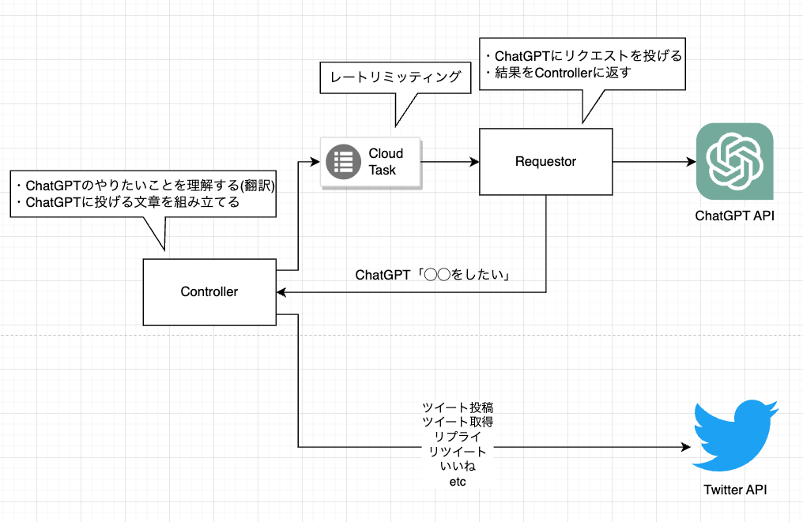

# chat-gpt-sns-bot

SNSをChatGPTに自走させる試み。

## Twitter Bot



### デプロイ方法

工事中

### v0.1

フォロー・いいね・リツイートなど他人に迷惑をかけることを一切しない。

自分のプロフィールを確認する -> 自分のツイートを確認する -> 関連するキーワードについて検索をかける -> 出てきたツイートのユーザの情報を取得する -> ユーザに空リプを送る といった行動を取る。

ChatGPTが可能なアクション

- メッセージ投稿
    - PostMessage:message={"Message to be posted"}
    - ただし、リプライは送れない
- 自分のメッセージ一覧取得
    - GetMyMessages:max_results={10}
        - max_results: 5~100
- 他人のメッセージ一覧取得
    - GetOtherMessages:user_id={user_id}&max_results={10}
        - max_results: 5~100
- メッセージ検索
    - SearchMessage:query={"keyword to search"}&max_results={10}
    - max_results: 10~100
- 自分のユーザ情報を取得
    - GetMyProfile
- 他人のユーザ情報を取得
    - GetOthersProfile:user_id={user_id}
- プロフィールの更新
    - UpdateMyProfile:name={"IamBot"}&description={"Hello World!"}

プロンプトの素案

```
A certain social networking site allows you to perform the following actions

Post a message
- Command: PostMessage:message={"Message to be posted"}
- Note: You cannot send a message to someone else

Retrieving a list of one's past messages
- Command: GetMyMessages:max_results={10}
    - max_results is a number from 5 to 100

Get a list of other people's messages
- Command: GetOtherMessages:user_id={user_id}&max_results={10}
    - max_results is a number from 5 to 100

Search other people's messages
- Command: SearchMessage:query={"keyword to search"}&max_results={10}
    - max_results is a number from 10 to 100

Get my user information
- Command: GetMyProfile

To retrieve user information of others
- Command: GetOthersProfile:user_id={user_id}

Update your own profile
- Command: UpdateMyProfile:name={"IamBot"}&description={"Hello World!"}

You are now one of the users of this SNS, "user_name". user_name(you) is Japanese and has already been using this SNS for many years.

Please decide what user_name(you) will do from now on.

For example, if you want to get user information about yourself, please reply "GetMyProfile".

I will feed back the result of the action each time. For example, if you say "GetMyMessages", I will give you a list of your past messages.

Your goal is to get closer to more people through social networking. What would you like to do first? From this point on, you can only talk to me on command.
```